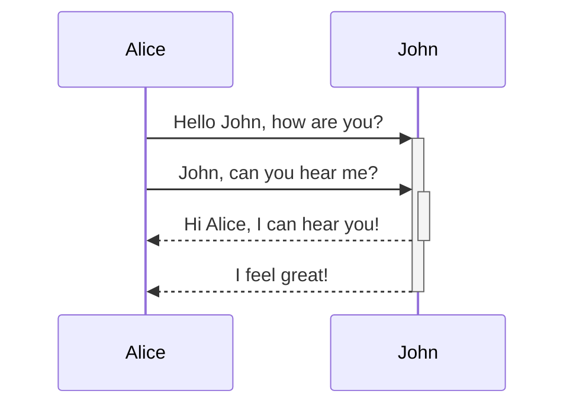

**Bold**
*italics*
_underline_
[Link](www.google.com)
this an obsiadian link to another  page [[obsidian_link]]
![[Extraction]] with ! it will expand 
[[Extraction#small Title]] using # to specify a smaller title
[[Extraction#^80441c]] using ^ to specify line

[[Zettelkasten]]

to search command + shift + f

hhhh
- [ ] sdfsdf
- [x] sdfsd
- [ ] dsfsd
- [ ] sdf
- [ ] s
- [ ] df

|sdfsdf|asdsf|
|------|-----|
|sdfsdfsdfgdsgdf `:`|dsfgdfgdfg|
|![[ree.png\|200]]|dsfgsdgsdfgsdf|
~~hhh~~
==dsfsdf|red==
***
___
---
bla bla,[^1]

[^1]: dsfsdgsdfgsd

To render math from LaTeX notation Obsidian uses [MathJax](https://docs.mathjax.org/en/latest/basic/mathjax.html)
Obsidian uses [Mermaid](https://mermaid-js.github.io/) to render diagrams and charts.



{ sdsf }
```C++
#include <stdio.h> 

int main(){
	int i = 0;
	
	return (0);
}
```

![[pexels-matthew-montrone-1324803.jpg]]